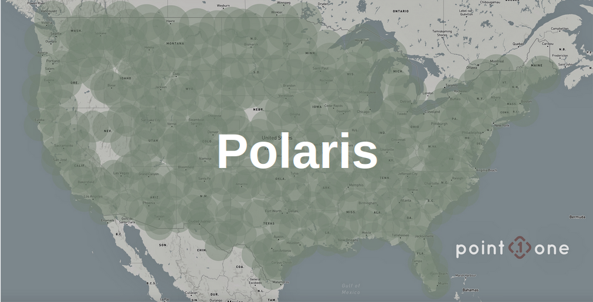
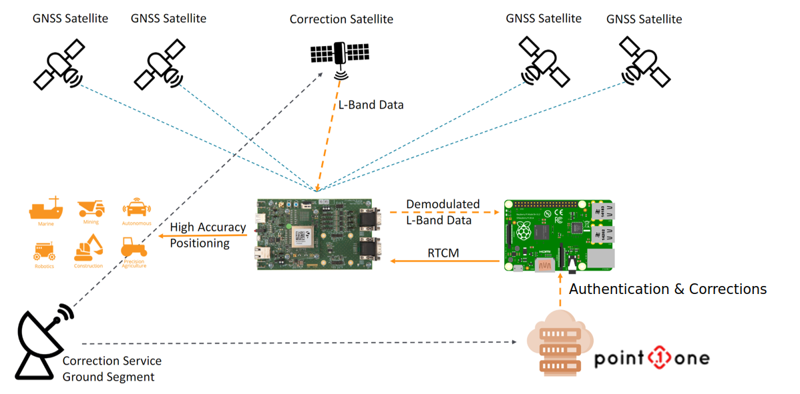
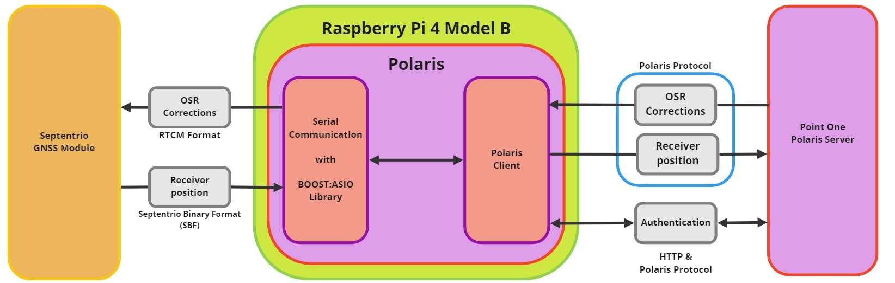
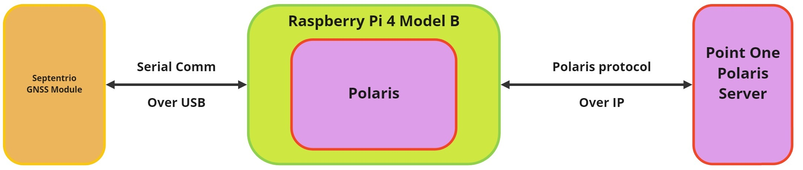
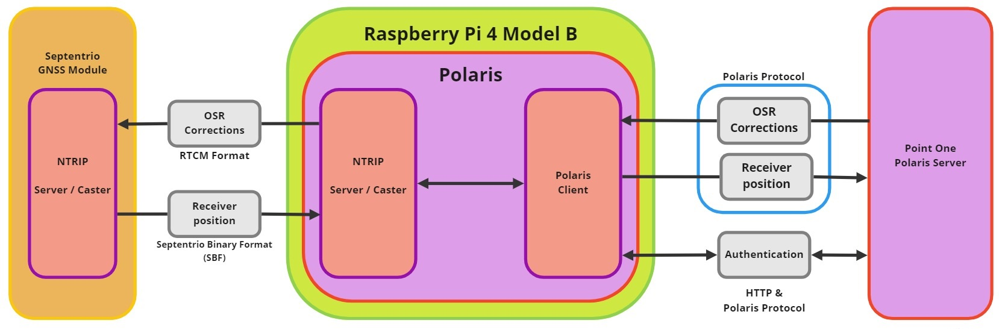
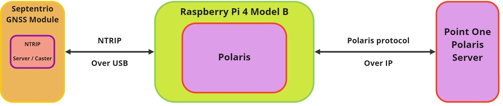
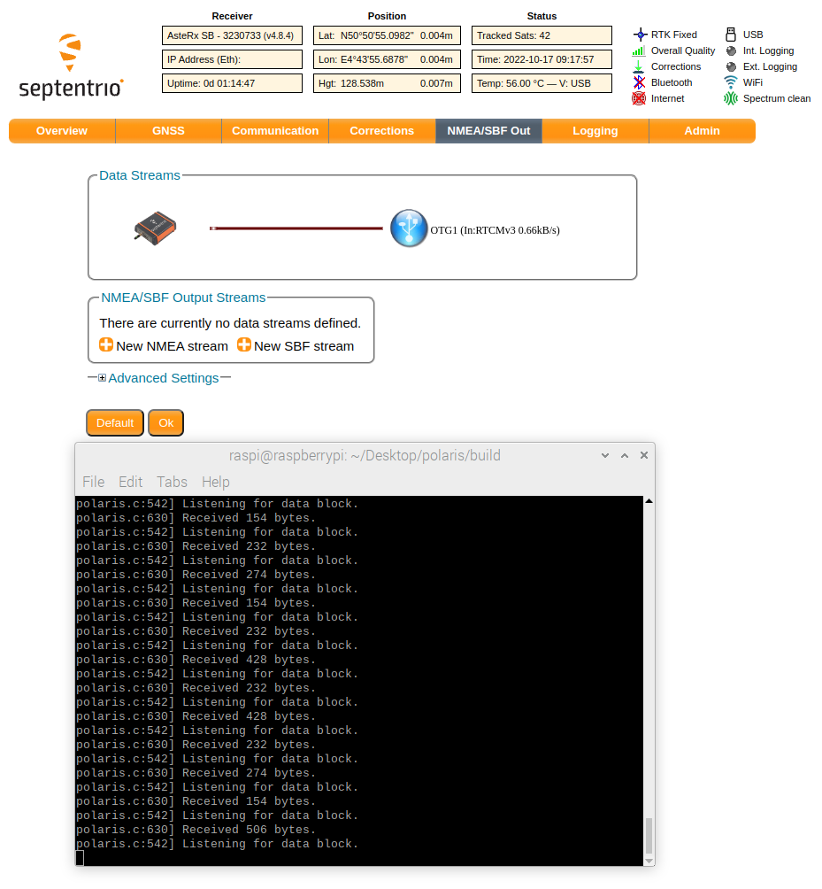

 
# Using Septentrio's Receiver and Point One's OSR corrections for precise positioning

## AUTHORS
  
| Name | GitHub |
|------|--------|
| Iker Uranga | <a href="https://github.com/IkerUranga10">IkerUranga10</a>   |    

## MAINTAINER
  
| GitHub |
|--------|
| <a href="https://github.com/septentrio-users">septentrio-users</a>   |    

## DO YOU HAVE ANY QUESTIONS? CONTACT SEPTENTRIO SUPPORT TEAM

| <a href="https://web.septentrio.com/GH-SSN-support ">Septentrio Support Page</a>|
|---|

## SEPTENTRIO LINKS FOR USERS
 
| Contact                                                                          | Septentrio Home Page                                                        |
|----------------------------------------------------------------------------------|-----------------------------------------------------------------------------|
| <a href="https://web.septentrio.com/GH-SSN-contact ">Septentrio Contact Page</a> | <a href="https://web.septentrio.com/POI-SSN-home">Septentrio Home Page</a> |

## DISCLAIMER
  
This set of guidelines consist of a several practical examplse to help Septentrio Module users and developers to integrate third party GNSS corrections. The guidelines are based on a concrete setup, which you may or may not use to follow the integration guidelines.

It is desirable to mention the disclaimer about that setup and the guides in general before starting reading this guide.
  
| <a href="https://github.com/septentrio-gnss/Septentrio_AgnosticCorrectionsProgram/tree/main/Receiver%20and%20Raspberry%20Setup#disclaimer">Click here to know more about the Setup in which these guides are based and general implementation documentation disclaimer</a> |
|---|

## TABLE OF CONTENTS

<!--ts-->

* [Polaris API](#polaris-api)
    * [Implementation specifications](#implementation-specifications)
        * [Raspberry Pi and Septentrio Receivers](#raspberry-pi-and-septentrio-receivers)
        * [Polaris Release](#polaris-release)
* [General flowchart and architecture schemes](#General-flowchart-and-architecture-schemes)  
    * [Information exchange formats between the receiver and the Raspberry Pi 4](#information-exchange-formats-between-the-receiver-and-the-raspberry-pi-4) 
    * [Using Serial communication](#using-serial-communication)
    * [Using NTRIP](#using-ntrip)
    * [Connection to Polaris Server](#connection-to-polaris-server)
* [Corrections with Polaris and Septentrio Receiver](#corrections-with-polaris-and-septentrio-receiver)
    * [Polaris Requirements](#polaris-requirements)
    * [Building Polaris From Source with CMake](#building-polaris-from-source-with-cmake)
    * [Running Polaris Client Example With Serial Port](#running-polaris-client-example-with-serial-port)
        * [Verifying corrections with PolarisClient](#verifying-corrections-with-polarisclient)
    * [Running Polaris Client Example With NTRIP](#running-polaris-client-example-with-ntrip)

<!--te-->

## POLARIS API

    

Polaris is Point One Navigation's cloud based correction service for both GNSS and Climate data. Use this API for getting correction data to your GNSS receiver including our development kits, Point One Certified Partner chips, or other standards compliant GNSS receivers.

Point One’s Polaris network is a proprietary GNSS and pressure correction network built from the ground up by Point One for the needs of modern automotive and robotics customers. The network uses the latest in base station technology including advanced anti-jam, interference mitigation, security and integrity monitoring. Their pressure sensors are found in urban areas for accurate barometric reference which can aid in vertical axis accuracy.

Polaris enables positioning accuracy of better than 10cm (95%) in open sky. Integrity is a major component of the design and it remains affordable enough to be used in mass market applications.

Their service is multi constellation and Connectivity agnostic.

| <a href="https://pointonenav.com/docs/">Click here to the navigate to Polaris Examples, tutorials, datasheets and API references.</a> |
|---|
   

The official Point One Navigation Polaris Service repository supported by <a href="https://github.com/PointOneNav"> PointOne GitHub user</a> is as follows:

    https://github.com/PointOneNav/polaris

## IMPLEMENTATION SPECIFICATIONS

### Raspberry Pi and Septentrio Receivers

For this implementation a Raspberry PI 4 Model B with 4 GB of RAM has been used. The use of another model of Raspberry PI should work but has not been tested, although the use of the this model is recommended.

A Mosaic-Go Module has been used for this implementation by Septentrio. It is possible to use any other receiver/board/module from Septentrio, if the connections and configurations of each of the elements mentioned both in this guide for implementing Point One OSR corrections and in the reference guide for implementing the setup on which this guide are correctly made.

If you want to know more about our different modules:

| <a href="https://web.septentrio.com/POI-SSN-RX">Click here to the access to the all Septentrio GNSS Modules page.</a> |
|---|
   

| <a href="https://github.com/septentrio-gnss/Septentrio_AgnosticCorrectionsProgram/tree/main/Receiver%20and%20Raspberry%20Setup#set-up-guide-to-use-third-parties-corrections-with-septentrios-receiver-for-precise-positioning">Set Up Guide to use Third parties corrections with Septentrio's Receiver for precise positioning</a> |
|---|
   

### Polaris Release

**Note:** For this implementation the **Release v1.3.0** (Sep 17, 2021 Update) has been used.

## General flowchart and architecture schemes

In general, the operation of the system that implements the Polaris library for obtaining the corrections, consists of the Polaris library running inside the Raspberry Pi and performing the relevant communications to get the position of the receiver to the Polaris server, so that once it has the position it is able to send the appropriate corrections to the receiver.

For the system on which this guide is based, a cable is used to connect the receiver and the Raspberry Pi. To connect the Raspberry Pi to the Polaris server, a Wi-Fi connection is used in this case.

The general flowchart of the system:

    

As mentioned earlier in this section, the system is composed of two main parts consisting of the communication of the receiver with the Raspberry Pi 4 and the communication of the Raspberry Pi 4 with the Polaris Server, and in the middle is the Polaris library.

The communication between the Raspberry Pi 4 and the receiver **can be done with two different communication protocols**, these are **Serial Communication** and **NTRIP**. On the other hand, regardless of the communication protocol selected for the exchange of information between the receiver and the Raspberry Pi 4, the access to the Polaris Server will always be the same, i.e. using the **Polaris Protocol**.
    
Please keep in mind that all explanations are based on the setup described in the following guide:

| <a href="https://github.com/septentrio-gnss/Septentrio_AgnosticCorrectionsProgram/tree/main/Receiver%20and%20Raspberry%20Setup#set-up-guide-to-use-third-parties-corrections-with-septentrios-receiver-for-precise-positioning">Set Up Guide to use Third parties corrections with Septentrio's Receiver for precise positioning</a> |
|---|
   

### Information exchange formats between the receiver and the Raspberry Pi 4

Regardless of which communication protocol is being used between the Raspberry Pi and the receiver

| Sending Receiver position information: |
| For sending the position and timing of the receiver, it is done by Septentrio Binary Format or SBF, and the particular message type is PVTGeodetic. |
|---|
   

| Reception of corrections: |
| For the reception of corrections, these come always in RTCM v3 format. Specifically, the message types are RTCM1005, RTCM1033, RTCM1047, RTCM1084, RTCM1094, RTCM1124 and RTCM1230. |
|---|
   

It is possible to implement the Polaris library in a similar system and therefore receive its corrections but this guide only covers the setup described in the above link.

Therefore, the following subsections provide a high-level explanation of the three types of communication with a schematic diagram to help understand what the different elements of this system are and how they are interconnected.

The following cases will be discussed below:
    
- NTRIP communication between the receiver and the Raspberry Pi 4.
- Serial communication between the receiver and the Raspberry Pi 4.
- Access to the Polaris Server via Polaris Protocol.
    
    
### Using Serial communication

If you are using the serial communication protocol over the USB cable, Polaris uses the open source library called BOOST:ASIO, a library from the C++ library set and whose acronym stands for Asynchronous and Synchronous Input and Output.

The image below shows a schematic diagram of something level in which the different elements of the system and the type of information exchanged between them appear.

    
    
The following image shows a simplification of the previous scheme and its objective is to show which protocols and communication channels are used to communicate the elements that form the system.
    

    
    
### Using NTRIP
    
In case the NTRIP protocol is being used, Polaris incorporates an NTRIP Server / Caster, which in this case is in charge of communicating with the NTRIP client that the Septentrio modules incorporate inside. 
    

    

The following image shows a simplification of the previous scheme and its objective is to show which protocols and communication channels are used to communicate the elements that form the system.
    

    
    
### Connection to Polaris Server

## Corrections with Polaris and Septentrio Receiver

### Polaris Requirements

For more information about <a href="https://github.com/PointOneNav/polaris#requirements-1"> Polaris' requirements</a> please visit Requirements section of the official OSR-Producer GitHub page.

- <a href="https://bazel.build/"> Bazel 3.6+</a>, or <a href="https://cmake.org/"> CMake 3.3+</a>  and GNU Make

- <a href="https://github.com/gflags/gflags"> Google gflags 2.2.2+</a>

- <a href="https://github.com/google/glog"> Google glog 0.4.0+</a>

- <a href="https://www.boost.org/"> Boost 1.58+</a> (for building example applications only)

- <a href="https://www.openssl.org/"> OpenSSL </a> or <a href="https://boringssl.googlesource.com/boringssl/"> BoringSSL </a>(optional; required for TLS support (strongly recommended))

### Building Polaris From Source with CMake

The following instructions have been obtained from the <a href="https://github.com/PointOneNav/polaris#building-from-source-1"> Building from Source section of the official Polaris repository</a>. 

Install all required libraries:

    sudo apt install cmake libssl-dev libgflags-dev libgoogle-glog-dev libboost-all-dev

OpenSSL is required by default and strongly recommended, but may be disabled by specifying -DPOLARIS_ENABLE_TLS=OFF to the cmake command below.

Clone the Polaris source code:

    git clone https://github.com/PointOneNav/polaris.git
    cd polaris

Create a build/ directory and run CMake to configure the build tree:

    mkdir build
    cd build
    cmake ..

Compile the Polaris source code and example applications:

    make

### Running Polaris Client Example With Serial Port

A generic example of how to run polaris client to get corrections:

    ./build/examples/septentrio_osr_example/septentrio_osr_example \
        --polaris-osr --polaris-osr-api-key=0123456789 \
        --polaris-osr-unique-id=my-second-vehicle \
        --device=/dev/ttyACM0

Using CMake from repo root directory:

    ./build/septentrio_osr_example --polaris_api_key=<POLARIS_API_KEY> --device=/dev/ttyACM0

If you want to enable debug print in terminal, add --v=2 to the command:

    ./build/septentrio_osr_example --polaris_api_key=<POLARIS_API_KEY> --device=/dev/ttyACM0 --v=2

#### Verifying corrections with PolarisClient

You can view the corrections status on the Septentrio HTTP interface http://192.168.3.1. If the corrections are being received, it should be noted in Corrections -> Corrections input tab. After receiving corrections for some time, the receiver should enter RTK float or RTK fixed modes.

    

### Running Polaris Client Example With NTRIP
       
To run Polaris with the NTRIP protocol, it is necessary to install <a href="https://bazel.build/?hl=es-419"> Bazel</a>. Bazel is a free software tool used for building and testing automation software.

For more information about how to install Bazel and how to run the library to get corrections to the receiver via NTRIP, see <a href="https://github.com/PointOneNav/polaris">Point One Navigation Polaris Services</a> on GitHub.
